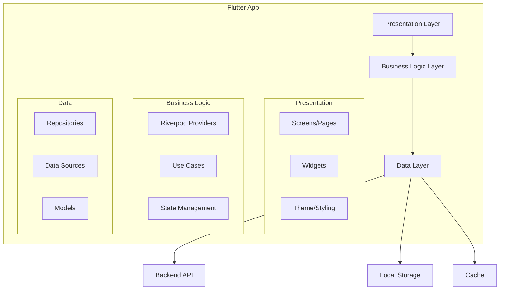

# Flutter Implementation Guide - SOI Volunteer Management System

## 🎯 Overview

This guide provides the complete implementation roadmap for building the SOI Volunteer Management System using Flutter. It covers architecture, project structure, key packages, code patterns, and best practices.

## 🏗️ Architecture Overview



## 📁 Project Structure

```
soi_volunteer_app/
├── lib/
│   ├── main.dart                 # App entry point
│   ├── app.dart                  # App configuration
│   ├── config/
│   │   ├── constants.dart        # App constants
│   │   ├── routes.dart           # Route definitions
│   │   └── theme.dart            # SOI theme configuration
│   │
│   ├── core/
│   │   ├── api/
│   │   │   ├── api_client.dart   # Dio HTTP client
│   │   │   ├── interceptors/     # Auth, logging interceptors
│   │   │   └── exceptions.dart   # API exceptions
│   │   │
│   │   ├── database/
│   │   │   ├── database.dart     # Drift database
│   │   │   └── daos/             # Data access objects
│   │   │
│   │   ├── services/
│   │   │   ├── auth_service.dart
│   │   │   ├── sync_service.dart
│   │   │   └── notification_service.dart
│   │   │
│   │   └── utils/
│   │       ├── validators.dart
│   │       ├── formatters.dart
│   │       └── extensions.dart
│   │
│   ├── features/
│   │   ├── auth/
│   │   │   ├── data/
│   │   │   │   ├── models/
│   │   │   │   ├── repositories/
│   │   │   │   └── sources/
│   │   │   ├── domain/
│   │   │   │   ├── entities/
│   │   │   │   ├── repositories/
│   │   │   │   └── use_cases/
│   │   │   └── presentation/
│   │   │       ├── screens/
│   │   │       ├── widgets/
│   │   │       └── providers/
│   │   │
│   │   ├── volunteer_profile/
│   │   ├── events/
│   │   ├── tasks/
│   │   ├── notifications/
│   │   └── settings/
│   │
│   └── shared/
│       ├── widgets/
│       │   ├── buttons/
│       │   ├── cards/
│       │   ├── dialogs/
│       │   └── loading/
│       └── providers/
│
├── assets/
│   ├── images/
│   ├── fonts/
│   └── icons/
│
├── test/
├── integration_test/
└── pubspec.yaml
```

## 📦 Key Dependencies

```yaml
# pubspec.yaml
name: soi_volunteer_app
description: Special Olympics Ireland Volunteer Management System

environment:
  sdk: '>=3.2.0 <4.0.0'
  flutter: '>=3.16.0'

dependencies:
  flutter:
    sdk: flutter
  
  # State Management
  flutter_riverpod: ^2.4.0
  riverpod_annotation: ^2.2.0
  
  # Navigation
  go_router: ^12.1.0
  
  # Networking
  dio: ^5.3.4
  retrofit: ^4.0.3
  
  # Local Storage
  drift: ^2.13.1
  sqlite3_flutter_libs: ^0.5.18
  shared_preferences: ^2.2.2
  flutter_secure_storage: ^9.0.0
  
  # UI/UX
  flutter_native_splash: ^2.3.5
  lottie: ^2.7.0
  cached_network_image: ^3.3.0
  shimmer: ^3.0.0
  
  # Forms & Validation
  reactive_forms: ^16.1.1
  
  # Utilities
  freezed_annotation: ^2.4.1
  json_annotation: ^4.8.1
  intl: ^0.18.1
  collection: ^1.18.0
  
  # Offline Support
  connectivity_plus: ^5.0.1
  
  # Notifications
  firebase_messaging: ^14.7.6
  flutter_local_notifications: ^16.2.0
  
  # Authentication
  google_sign_in: ^6.1.6
  sign_in_with_apple: ^5.0.0
  
  # Analytics & Monitoring
  firebase_analytics: ^10.7.4
  sentry_flutter: ^7.13.2
  
  # Camera & Images
  image_picker: ^1.0.4
  image: ^4.1.3
  
  # WebSocket
  web_socket_channel: ^2.4.0

dev_dependencies:
  flutter_test:
    sdk: flutter
  flutter_lints: ^3.0.1
  build_runner: ^2.4.6
  freezed: ^2.4.5
  json_serializable: ^6.7.1
  drift_dev: ^2.13.1
  retrofit_generator: ^8.0.4
  riverpod_generator: ^2.3.3
  mockito: ^5.4.3
```

## 🎨 SOI Theme Implementation

```dart
// lib/config/theme.dart
import 'package:flutter/material.dart';

class SOIColors {
  // Primary Colors
  static const Color primaryGreen = Color(0xFF2E7D32);
  static const Color primaryBlue = Color(0xFF1976D2);
  
  // Secondary Colors
  static const Color secondaryOrange = Color(0xFFFF6F00);
  static const Color secondaryPurple = Color(0xFF6A1B9A);
  
  // Neutral Colors
  static const Color textPrimary = Color(0xFF212121);
  static const Color textSecondary = Color(0xFF757575);
  static const Color surface = Color(0xFFF5F5F5);
  static const Color background = Color(0xFFFAFAFA);
  
  // Semantic Colors
  static const Color success = Color(0xFF4CAF50);
  static const Color warning = Color(0xFFFF9800);
  static const Color error = Color(0xFFD32F2F);
  static const Color info = Color(0xFF2196F3);
}

class SOITheme {
  static ThemeData get lightTheme {
    return ThemeData(
      useMaterial3: true,
      colorScheme: ColorScheme.fromSeed(
        seedColor: SOIColors.primaryGreen,
        primary: SOIColors.primaryGreen,
        secondary: SOIColors.primaryBlue,
        surface: SOIColors.surface,
        background: SOIColors.background,
        error: SOIColors.error,
      ),
      appBarTheme: const AppBarTheme(
        centerTitle: true,
        elevation: 0,
        backgroundColor: SOIColors.primaryGreen,
        foregroundColor: Colors.white,
      ),
      elevatedButtonTheme: ElevatedButtonThemeData(
        style: ElevatedButton.styleFrom(
          backgroundColor: SOIColors.primaryGreen,
          foregroundColor: Colors.white,
          minimumSize: const Size(double.infinity, 48),
          shape: RoundedRectangleBorder(
            borderRadius: BorderRadius.circular(8),
          ),
        ),
      ),
      inputDecorationTheme: InputDecorationTheme(
        filled: true,
        fillColor: Colors.white,
        border: OutlineInputBorder(
          borderRadius: BorderRadius.circular(8),
          borderSide: const BorderSide(color: SOIColors.textSecondary),
        ),
        enabledBorder: OutlineInputBorder(
          borderRadius: BorderRadius.circular(8),
          borderSide: BorderSide(color: SOIColors.textSecondary.withOpacity(0.3)),
        ),
        focusedBorder: OutlineInputBorder(
          borderRadius: BorderRadius.circular(8),
          borderSide: const BorderSide(color: SOIColors.primaryGreen, width: 2),
        ),
      ),
      cardTheme: CardTheme(
        elevation: 2,
        shape: RoundedRectangleBorder(
          borderRadius: BorderRadius.circular(12),
        ),
      ),
    );
  }
}
```

## 🔐 Authentication Implementation

```dart
// lib/features/auth/domain/entities/user.dart
import 'package:freezed_annotation/freezed_annotation.dart';

part 'user.freezed.dart';
part 'user.g.dart';

@freezed
class User with _$User {
  const factory User({
    required String id,
    required String email,
    required String firstName,
    required String lastName,
    required UserType userType,
    String? profileImageUrl,
    @Default(false) bool emailVerified,
    DateTime? lastLogin,
  }) = _User;

  factory User.fromJson(Map<String, dynamic> json) => _$UserFromJson(json);
}

enum UserType {
  volunteer,
  staff,
  vmt,
  cvt,
  admin,
  superAdmin,
}
```

```dart
// lib/features/auth/presentation/providers/auth_provider.dart
import 'package:flutter_riverpod/flutter_riverpod.dart';
import 'package:riverpod_annotation/riverpod_annotation.dart';

part 'auth_provider.g.dart';

@riverpod
class Auth extends _$Auth {
  @override
  Future<User?> build() async {
    // Check for stored auth token
    final token = await _secureStorage.read(key: 'auth_token');
    if (token == null) return null;
    
    // Validate token and get user
    try {
      return await _authRepository.getCurrentUser();
    } catch (e) {
      // Token invalid, clear it
      await _secureStorage.delete(key: 'auth_token');
      return null;
    }
  }

  Future<void> login(String email, String password) async {
    state = const AsyncValue.loading();
    state = await AsyncValue.guard(() async {
      final response = await _authRepository.login(email, password);
      await _secureStorage.write(key: 'auth_token', value: response.token);
      await _secureStorage.write(key: 'refresh_token', value: response.refreshToken);
      return response.user;
    });
  }

  Future<void> logout() async {
    await _authRepository.logout();
    await _secureStorage.deleteAll();
    state = const AsyncValue.data(null);
  }
}
```

## 📱 Screen Examples

### Login Screen

```dart
// lib/features/auth/presentation/screens/login_screen.dart
import 'package:flutter/material.dart';
import 'package:flutter_riverpod/flutter_riverpod.dart';
import 'package:reactive_forms/reactive_forms.dart';

class LoginScreen extends ConsumerStatefulWidget {
  const LoginScreen({super.key});

  @override
  ConsumerState<LoginScreen> createState() => _LoginScreenState();
}

class _LoginScreenState extends ConsumerState<LoginScreen> {
  late final FormGroup form;

  @override
  void initState() {
    super.initState();
    form = FormGroup({
      'email': FormControl<String>(
        validators: [Validators.required, Validators.email],
      ),
      'password': FormControl<String>(
        validators: [Validators.required, Validators.minLength(8)],
      ),
    });
  }

  @override
  Widget build(BuildContext context) {
    final authState = ref.watch(authProvider);

    return Scaffold(
      body: SafeArea(
        child: Padding(
          padding: const EdgeInsets.all(24.0),
          child: ReactiveForm(
            formGroup: form,
            child: Column(
              mainAxisAlignment: MainAxisAlignment.center,
              children: [
                // SOI Logo
                Image.asset(
                  'assets/images/soi_logo.png',
                  height: 120,
                ),
                const SizedBox(height: 48),
                
                // Welcome Text
                Text(
                  'Welcome Back!',
                  style: Theme.of(context).textTheme.headlineMedium?.copyWith(
                    color: SOIColors.primaryGreen,
                    fontWeight: FontWeight.bold,
                  ),
                ),
                const SizedBox(height: 8),
                Text(
                  'Login to your volunteer account',
                  style: Theme.of(context).textTheme.bodyLarge?.copyWith(
                    color: SOIColors.textSecondary,
                  ),
                ),
                const SizedBox(height: 32),

                // Email Field
                ReactiveTextField<String>(
                  formControlName: 'email',
                  decoration: const InputDecoration(
                    labelText: 'Email',
                    prefixIcon: Icon(Icons.email_outlined),
                  ),
                  keyboardType: TextInputType.emailAddress,
                ),
                const SizedBox(height: 16),

                // Password Field
                ReactiveTextField<String>(
                  formControlName: 'password',
                  decoration: const InputDecoration(
                    labelText: 'Password',
                    prefixIcon: Icon(Icons.lock_outline),
                  ),
                  obscureText: true,
                ),
                const SizedBox(height: 24),

                // Login Button
                ReactiveFormConsumer(
                  builder: (context, form, child) {
                    return ElevatedButton(
                      onPressed: form.valid && !authState.isLoading
                          ? () => _handleLogin()
                          : null,
                      child: authState.isLoading
                          ? const CircularProgressIndicator(color: Colors.white)
                          : const Text('Login'),
                    );
                  },
                ),
                const SizedBox(height: 16),

                // Forgot Password
                TextButton(
                  onPressed: () => context.go('/forgot-password'),
                  child: const Text('Forgot Password?'),
                ),

                const Spacer(),

                // Register Link
                Row(
                  mainAxisAlignment: MainAxisAlignment.center,
                  children: [
                    const Text("Don't have an account?"),
                    TextButton(
                      onPressed: () => context.go('/register'),
                      child: const Text('Register'),
                    ),
                  ],
                ),
              ],
            ),
          ),
        ),
      ),
    );
  }

  void _handleLogin() async {
    if (form.valid) {
      final email = form.control('email').value as String;
      final password = form.control('password').value as String;
      
      await ref.read(authProvider.notifier).login(email, password);
      
      if (mounted && ref.read(authProvider).hasValue) {
        context.go('/dashboard');
      }
    }
  }
}
```

### Volunteer Dashboard

```dart
// lib/features/volunteer_profile/presentation/screens/volunteer_dashboard.dart
import 'package:flutter/material.dart';
import 'package:flutter_riverpod/flutter_riverpod.dart';

class VolunteerDashboard extends ConsumerWidget {
  const VolunteerDashboard({super.key});

  @override
  Widget build(BuildContext context, WidgetRef ref) {
    final user = ref.watch(authProvider).value!;
    final upcomingTasks = ref.watch(upcomingTasksProvider);
    final stats = ref.watch(volunteerStatsProvider);

    return Scaffold(
      appBar: AppBar(
        title: const Text('My Dashboard'),
        actions: [
          IconButton(
            icon: const Icon(Icons.notifications_outlined),
            onPressed: () => context.push('/notifications'),
          ),
        ],
      ),
      body: RefreshIndicator(
        onRefresh: () async {
          ref.invalidate(upcomingTasksProvider);
          ref.invalidate(volunteerStatsProvider);
        },
        child: CustomScrollView(
          slivers: [
            // Welcome Header
            SliverToBoxAdapter(
              child: Container(
                padding: const EdgeInsets.all(24),
                color: SOIColors.primaryGreen.withOpacity(0.1),
                child: Column(
                  crossAxisAlignment: CrossAxisAlignment.start,
                  children: [
                    Text(
                      'Welcome back, ${user.firstName}!',
                      style: Theme.of(context).textTheme.headlineSmall,
                    ),
                    const SizedBox(height: 8),
                    stats.when(
                      data: (data) => Text(
                        'You have ${data.completedTasks} completed tasks',
                        style: Theme.of(context).textTheme.bodyLarge,
                      ),
                      loading: () => const Shimmer(
                        gradient: LinearGradient(colors: []),
                        child: Container(height: 20, width: 200),
                      ),
                      error: (_, __) => const SizedBox(),
                    ),
                  ],
                ),
              ),
            ),

            // Quick Actions
            SliverToBoxAdapter(
              child: Padding(
                padding: const EdgeInsets.all(16),
                child: Column(
                  crossAxisAlignment: CrossAxisAlignment.start,
                  children: [
                    Text(
                      'Quick Actions',
                      style: Theme.of(context).textTheme.titleLarge,
                    ),
                    const SizedBox(height: 16),
                    Row(
                      children: [
                        Expanded(
                          child: _QuickActionCard(
                            icon: Icons.event,
                            label: 'Browse Events',
                            color: SOIColors.primaryBlue,
                            onTap: () => context.push('/events'),
                          ),
                        ),
                        const SizedBox(width: 12),
                        Expanded(
                          child: _QuickActionCard(
                            icon: Icons.assignment,
                            label: 'My Tasks',
                            color: SOIColors.secondaryOrange,
                            onTap: () => context.push('/tasks'),
                          ),
                        ),
                      ],
                    ),
                    const SizedBox(height: 12),
                    Row(
                      children: [
                        Expanded(
                          child: _QuickActionCard(
                            icon: Icons.person,
                            label: 'My Profile',
                            color: SOIColors.secondaryPurple,
                            onTap: () => context.push('/profile'),
                          ),
                        ),
                        const SizedBox(width: 12),
                        Expanded(
                          child: _QuickActionCard(
                            icon: Icons.qr_code_scanner,
                            label: 'Check In',
                            color: SOIColors.success,
                            onTap: () => context.push('/check-in'),
                          ),
                        ),
                      ],
                    ),
                  ],
                ),
              ),
            ),

            // Upcoming Tasks
            SliverToBoxAdapter(
              child: Padding(
                padding: const EdgeInsets.all(16),
                child: Text(
                  'Upcoming Tasks',
                  style: Theme.of(context).textTheme.titleLarge,
                ),
              ),
            ),
            upcomingTasks.when(
              data: (tasks) => tasks.isEmpty
                  ? SliverFillRemaining(
                      child: Center(
                        child: Column(
                          mainAxisAlignment: MainAxisAlignment.center,
                          children: [
                            Icon(
                              Icons.task_alt,
                              size: 64,
                              color: SOIColors.textSecondary.withOpacity(0.3),
                            ),
                            const SizedBox(height: 16),
                            Text(
                              'No upcoming tasks',
                              style: Theme.of(context).textTheme.bodyLarge?.copyWith(
                                color: SOIColors.textSecondary,
                              ),
                            ),
                          ],
                        ),
                      ),
                    )
                  : SliverList(
                      delegate: SliverChildBuilderDelegate(
                        (context, index) => _TaskCard(task: tasks[index]),
                        childCount: tasks.length,
                      ),
                    ),
              loading: () => SliverList(
                delegate: SliverChildBuilderDelegate(
                  (context, index) => const _TaskCardShimmer(),
                  childCount: 3,
                ),
              ),
              error: (error, _) => SliverFillRemaining(
                child: Center(
                  child: Text('Error: $error'),
                ),
              ),
            ),
          ],
        ),
      ),
    );
  }
}
```

## 🔄 Offline Support Implementation

```dart
// lib/core/services/sync_service.dart
import 'package:connectivity_plus/connectivity_plus.dart';
import 'package:drift/drift.dart';

class SyncService {
  final AppDatabase _database;
  final ApiClient _apiClient;
  final Connectivity _connectivity;
  
  StreamSubscription? _connectivitySubscription;
  bool _isSyncing = false;

  void initialize() {
    // Listen for connectivity changes
    _connectivitySubscription = _connectivity.onConnectivityChanged.listen(
      (ConnectivityResult result) {
        if (result != ConnectivityResult.none && !_isSyncing) {
          syncPendingData();
        }
      },
    );
  }

  Future<void> syncPendingData() async {
    if (_isSyncing) return;
    _isSyncing = true;

    try {
      // Sync pending volunteer profile updates
      final pendingProfiles = await _database.getPendingProfileUpdates();
      for (final profile in pendingProfiles) {
        await _syncProfile(profile);
      }

      // Sync pending task completions
      final pendingCompletions = await _database.getPendingTaskCompletions();
      for (final completion in pendingCompletions) {
        await _syncTaskCompletion(completion);
      }

      // Sync attendance records
      final pendingAttendance = await _database.getPendingAttendanceRecords();
      for (final record in pendingAttendance) {
        await _syncAttendanceRecord(record);
      }

      // Pull latest data from server
      await _pullLatestData();
    } catch (e) {
      print('Sync error: $e');
    } finally {
      _isSyncing = false;
    }
  }

  Future<void> _syncProfile(LocalProfile profile) async {
    try {
      final response = await _apiClient.updateProfile(profile.toApiModel());
      await _database.markProfileSynced(profile.id, response.lastModified);
    } catch (e) {
      // Handle sync error - maybe retry later
    }
  }

  // ... additional sync methods
}
```

## 🚀 Building & Deployment

### Development Setup

```bash
# 1. Install Flutter
# Follow instructions at https://flutter.dev/docs/get-started/install

# 2. Clone repository
git clone https://github.com/Special-Olympics-Ireland/soi-volunteer-app.git
cd soi-volunteer-app

# 3. Install dependencies
flutter pub get

# 4. Generate code
flutter pub run build_runner build --delete-conflicting-outputs

# 5. Run app
flutter run
```

### Build Commands

```bash
# iOS Build
flutter build ios --release

# Android Build
flutter build apk --release
flutter build appbundle --release

# Web Build
flutter build web --release --web-renderer canvaskit
```

### CI/CD with Codemagic

```yaml
# codemagic.yaml
workflows:
  ios-workflow:
    name: iOS Workflow
    environment:
      flutter: stable
      xcode: latest
      cocoapods: default
    scripts:
      - flutter packages pub get
      - flutter build ios --release --no-codesign
    artifacts:
      - build/ios/ipa/*.ipa

  android-workflow:
    name: Android Workflow
    environment:
      flutter: stable
    scripts:
      - flutter packages pub get
      - flutter build appbundle --release
    artifacts:
      - build/app/outputs/**/*.aab

  web-workflow:
    name: Web Workflow
    environment:
      flutter: stable
    scripts:
      - flutter packages pub get
      - flutter build web --release
    artifacts:
      - build/web/**
```

## 📊 Performance Optimization

### 1. Image Optimization
```dart
// Use cached_network_image with proper caching
CachedNetworkImage(
  imageUrl: volunteer.profileImageUrl,
  cacheKey: volunteer.profileImageUrl,
  maxHeightDiskCache: 400,
  memCacheHeight: 200,
  placeholder: (context, url) => const CircularProgressIndicator(),
  errorWidget: (context, url, error) => const Icon(Icons.error),
);
```

### 2. List Performance
```dart
// Use ListView.builder for large lists
ListView.builder(
  itemCount: volunteers.length,
  itemBuilder: (context, index) {
    return VolunteerCard(volunteer: volunteers[index]);
  },
  // Add these for better performance
  addAutomaticKeepAlives: false,
  addRepaintBoundaries: false,
);
```

### 3. State Management
```dart
// Use select to rebuild only when specific data changes
final userName = ref.watch(userProvider.select((user) => user?.name));
```

## 🧪 Testing Strategy

### Unit Tests
```dart
// test/features/auth/auth_service_test.dart
void main() {
  group('AuthService', () {
    test('login returns user on success', () async {
      final authService = AuthService(mockApiClient);
      when(mockApiClient.login(any, any)).thenAnswer(
        (_) async => LoginResponse(user: testUser, token: 'token'),
      );
      
      final result = await authService.login('test@example.com', 'password');
      
      expect(result.user.email, equals('test@example.com'));
    });
  });
}
```

### Widget Tests
```dart
// test/widgets/volunteer_card_test.dart
void main() {
  testWidgets('VolunteerCard displays volunteer name', (tester) async {
    await tester.pumpWidget(
      MaterialApp(
        home: VolunteerCard(
          volunteer: Volunteer(name: 'John Doe', role: 'Helper'),
        ),
      ),
    );
    
    expect(find.text('John Doe'), findsOneWidget);
    expect(find.text('Helper'), findsOneWidget);
  });
}
```

### Integration Tests
```dart
// integration_test/app_test.dart
void main() {
  IntegrationTestWidgetsFlutterBinding.ensureInitialized();

  group('end-to-end test', () {
    testWidgets('user can login and view dashboard', (tester) async {
      app.main();
      await tester.pumpAndSettle();

      // Login
      await tester.enterText(find.byType(TextField).first, 'test@example.com');
      await tester.enterText(find.byType(TextField).last, 'password');
      await tester.tap(find.text('Login'));
      await tester.pumpAndSettle();

      // Verify dashboard
      expect(find.text('My Dashboard'), findsOneWidget);
    });
  });
}
```

## 🎯 Next Steps

1. **Week 1**: Setup & Foundation
   - Initialize Flutter project
   - Configure packages
   - Implement authentication flow
   - Setup CI/CD

2. **Week 2**: Core Features
   - Volunteer registration (EOI)
   - Profile management
   - Event browsing

3. **Weeks 3-4**: Advanced Features
   - Task management
   - Real-time notifications
   - Offline support

4. **Week 5**: Polish & Testing
   - Performance optimization
   - Comprehensive testing
   - Bug fixes

---

*This implementation guide will be continuously updated as development progresses. For questions or clarifications, please contact the development team.* 